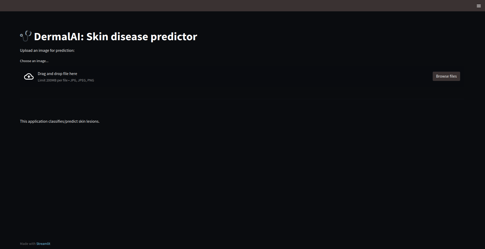
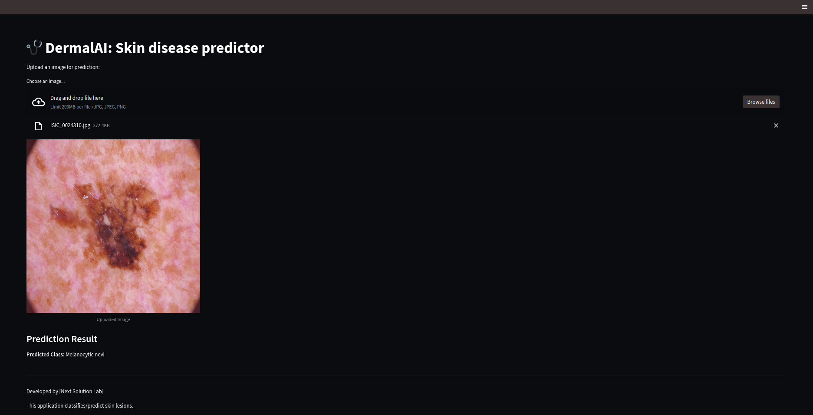

# 🩺 DermaVision: A Skin Disease Predictor
---

### 🛠 Skills: Tensorflow | Sklearn | Numpy | Pandas 
---

## 🌟 Introduction

Skin diseases are a significant public health issue affecting millions of people worldwide. Early detection and accurate diagnosis are crucial for effective treatment and management. In this project, we aim to build a deep-learning model to classify/predict various skin diseases based on images. The model will help dermatologists and healthcare professionals diagnose skin conditions more efficiently.

## 🎯 Objectives

- To develop a **Convolutional Neural Network (CNN)** model using **DenseNet201** for skin disease classification.
- To evaluate the model's performance on some skin images.
- To deploy the trained model for real-time prediction in a web application.

## Benefits

1. 🎯 **Improved Diagnostic Accuracy:**
Deep learning models, especially convolutional neural networks (CNNs), demonstrate exceptional accuracy in identifying and categorizing skin conditions. These models can identify subtle patterns in skin images, leading to accurate diagnoses, even for challenging or rare skin diseases.

2. ⏳ **Early Detection:**
Detecting skin diseases like melanoma early significantly improves treatment success. Deep learning models can spot small changes in skin lesions that might be overlooked, allowing for early diagnosis and timely medical intervention.

3. ⚡ **Fast and Automated Diagnosis:**
Deep learning models can rapidly analyze and classify skin disease images, speeding up diagnosis compared to manual dermatological assessments. This enhances patient flow and reduces healthcare professionals' workload.

4. 🌍 **Accessibility to Healthcare:**
AI-powered mobile applications allow patients in remote or underserved areas to receive initial diagnostic support by simply uploading images of skin lesions. This is crucial where access to dermatologists is limited.

5. 📈 **Scalability:**
Deep learning models efficiently handle large volumes of skin image data, making them suitable for high-throughput clinical environments and telemedicine, helping dermatologists manage large patient loads.

6. 🔄 **Consistency in Diagnosis:**
AI models ensure diagnostic consistency, as they aren’t affected by fatigue or subjective factors, providing uniform results regardless of external conditions.

7. 💰 **Cost-effective Screening:**
By automating the diagnostic process, AI tools help cut healthcare costs by reducing unnecessary consultations. This allows doctors to focus on more complex cases.

8. 📚 **Learning and Adapting with New Data:**
These models can be retrained as new data and guidelines emerge, continuously improving their accuracy and staying updated with the latest medical practices.

9. 🧑‍⚕️ **Complementary to Experts:**
Rather than replacing dermatologists, AI tools support them by providing highly accurate, fast preliminary diagnoses, allowing doctors to focus on complex cases.

10. 🏠 **Potential for Remote Monitoring:**
Deep learning apps allow patients to monitor chronic skin conditions from home, offering a convenient way to stay proactive about their health without frequent doctor visits.

## 🖼️ File Structure:
```
    DermaVision/
    │
    ├── 📄 checkpoint                       # Checkpoint of the model
    │   └── 📄 densenet_model.h5           # Densenet trained model
    │
    ├── 🖼️ Dataset/                      # Dataset folder
    │   ├── Train/                       # Train directory
    │   └── Test/                        # Test directory
    │
    ├── 📸 screenshots/                    # Directory for application screenshots
    │   ├── 1.png                          # Screenshot of the app interface
    │   └── 2.png                          # Screenshot of prediction
    │
    ├── 🤖 test_data/                       # Put the random image
    │   ├── test_image_name.png             # Saved model for person recognition
    │   └── test_image_name.jpg             # Additional models if needed
    │
    ├── main.py                            # Main code for training the model
    ├── preproces_dataset.py               # prepare and process the dataset for feedding the model
    ├── splitting_dataset.py               # Split the dataset into training and testing
    ├── Readme.md                          # All information related to the code
    └── UI.py                              # User interface-based Web application
    
```

## 📊 Dataset

The dataset used for this project consists of various skin disease images categorized into different classes. We will be using a publicly available dataset Human Against Machine [HAM10000](https://www.kaggle.com/datasets/kmader/skin-cancer-mnist-ham10000) with 10000 training images that contain labeled images of skin diseases such as:

- Actinic keratoses (AKIEC)
- Basal Cell Carcinoma (BCC)
- Benign keratosis-like lesions (BKL)
- Dermatofibroma (DF)
- Melanoma (MEL)
- Melanocytic nevi (NV)
- Vascular lesions (VASC)

## ⚙️ Environment Setup:
We have created a environment.yml file where all the necessary modules and packages are listed. For setting up the environment use

```bash
conda create env -f environment.yml
conda activate skin_env
```

### 🛠️ Dataset Preprocessing

To prepare data for feeding the model we use two Python code snippets. 
First,
```bash
python preprocess_dataset.py --root_dataset_dir /path/to/root_dir --output_dir /pah/to/output_dir
```
After that, Split the images for training and testing. For that,

```bash
python spliting_dataset.py --root_processed_dataset /path/to/processed_dataset --output_dir /pah/to/train_test_directory
```
We have also used,

1. **Image Resizing**: All images will be resized to a uniform size of \(224 \times 224\) pixels to match the input size expected by DenseNet201.
2. **Normalization**: Pixel values will be normalized to the range \([0, 1]\) by dividing by 255.
3. **Data Augmentation**: To improve the model's robustness and generalization, data augmentation techniques such as rotation, flipping, and zooming will be applied.

## 🏗️ Model Architecture

We will use **DenseNet201**, a state-of-the-art CNN architecture that employs dense connectivity patterns to improve feature propagation and reduce the number of parameters. The architecture consists of the following key components:

- **Convolutional Layers**: To extract features from the input images.
- **Pooling Layers**: To down-sample the feature maps and reduce dimensionality.
- **Dense Blocks**: Each dense block consists of several convolutional layers, where each layer receives input from all preceding layers.
- **Global Average Pooling Layer**: To reduce the feature maps to a single vector before the final classification layer.
- **Output Layer**: A softmax layer to classify the images into respective categories.


# 🚀 Training the Model
The model will be trained on the processed dataset using the following parameters:

- **Batch Size**: 32 (can be changed)
- **Epochs**: 50 (can be changed)
- **Learning Rate**: 0.001 (can be adjusted based on performance)
- **Loss Function**: Categorical Crossentropy
- During training, we will monitor the accuracy of the validation and use ModelCheckpoint to save the best-performing model.
```bash
python main.py --train_dir /path/to/train/data --test_dir /path/to/test/data --BATCH_SIZE 32 -EPOCHS 100
```

# 📈 Evaluation
After training, the model will be evaluated on a separate test dataset. Key performance metrics will include:

- **Accuracy**
- **Precision**
- **Recall**
- **F1 Score**
- **Confusion Matrix**
These metrics will help assess the model's ability to classify skin diseases accurately.
---

# 🌐 Deployment
To make the trained model accessible, we develop a web application using Streamlit. The application will allow users to upload images of skin lesions and receive predictions on the skin disease present in the image.

To run our UI type
```bash
streamlit run UI.py
```
If you want to use our pretrained model, please download it from this [huggingface](https://huggingface.co/nahidbrur/dermavision-densenet201/tree/main) and save it under checkpoint folder then change the path of the **model_path** in [UI.py](UI.py)

---

# 📱 Streamlit Application Features
- **Image Upload**: Users can upload images in formats like JPG, JPEG, or PNG.
Real-Time Prediction: The application will display the predicted skin disease and the confidence score.
- **User-Friendly Interface**: A simple and intuitive UI to enhance user experience.

---
# 📜 Conclusion
This project aims to create an effective skin disease classification model using DenseNet201. By leveraging deep learning techniques, we can assist healthcare professionals in diagnosing skin diseases more accurately and efficiently. The deployment of the model in a web application will further enhance accessibility and usability.

---

## 📸 Screenshots:
- Our user interface


- Upload an image and predict the skin disease



# 📚 References
- Deep Learning for [Skin Disease Classification](https://scholar.google.com/scholar?hl=en&as_sdt=0%2C5&q=skin+disease+classification+using+cnn&btnG=)
- [TensorFlow Documentation](https://www.tensorflow.org/api_docs)
